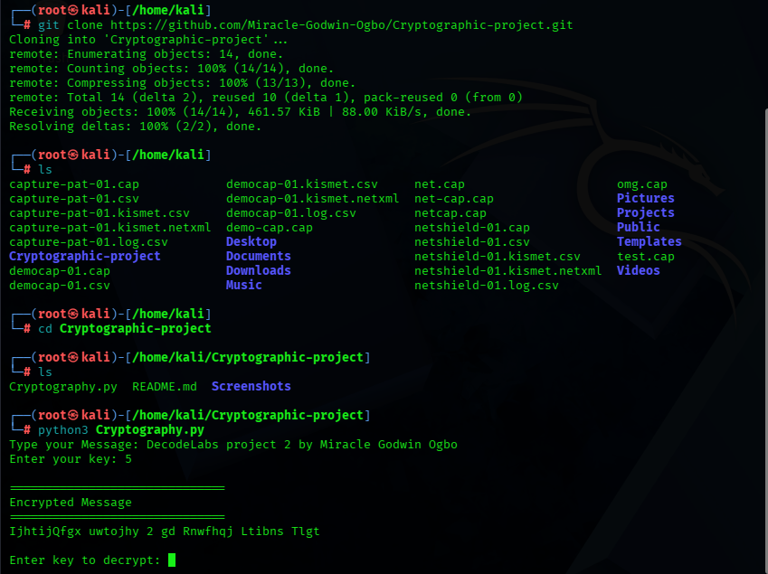
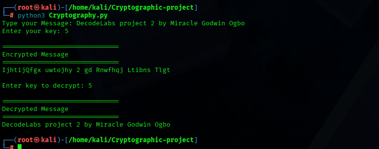
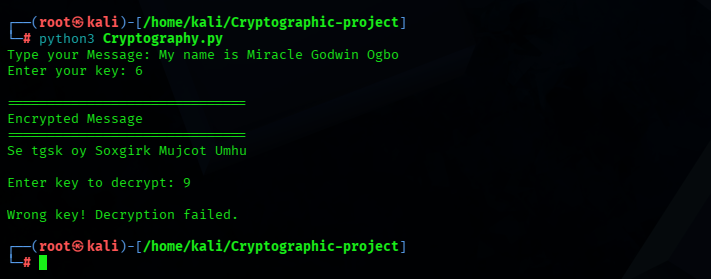

# 🔐 Caesar Cipher Encryption & Decryption Tool

A Python-based cryptographic tool developed as **Week 2** of the **DecodeLabs Cybersecurity Internship**. This project demonstrates the implementation of the **Caesar Cipher**, a classical symmetric encryption algorithm that encrypts and decrypts text using a shared secret key.

This project strengthened my understanding of Python programming, cryptography fundamentals, character encoding, loops, conditional statements, string manipulation, and encryption logic.

---

## ✨ Features

- Encrypts plaintext using the Caesar Cipher algorithm
- Decrypts ciphertext using the same key as encryption key
- Supports both uppercase and lowercase letters
- Preserves spaces, numbers, and special characters
- Uses a user-defined encryption key
- Interactive command-line interface
- Displays an error message when an incorrect decryption key is entered

---

## 🛠️ Technologies Used

- Python 3
- Visual Studio Code
- Git
- GitHub

---

## ⚙️ How It Works

### Encryption

1. The user enters a plaintext message.
2. The user enters an encryption key.
3. Each alphabetical character is shifted forward according to the key using the Caesar Cipher algorithm.
4. The encrypted message (ciphertext) is displayed.

### Decryption

1. The program prompts the user to enter the decryption key.
2. If the entered key matches the original encryption key, the ciphertext is decrypted.
3. The original plaintext message is displayed.
4. If an incorrect key is entered, the program displays:

```
Wrong key! Decryption failed.
```

---

## ▶️ How to Run

### 1. Clone the repository

```bash
git clone https://github.com/Miracle-Godwin-Ogbo/Cryptographic-project.git
```

### 2. Navigate to the project directory

```bash
cd Cryptographic-project
```

### 3. Run the program

**Linux (Kali Linux, Ubuntu, Debian, etc.)**

```bash
python3 Cryptography.py
```

**Windows**

```bash
python Cryptography.py
```

---

## 🐉 Running the Project on Kali Linux

The screenshots below demonstrate the project running successfully on Kali Linux.

### Successful Encryption (Kali Linux)



---

### Successful Decryption (Kali Linux)



---

### Failed Decryption (Incorrect Key)




---

## 🧪 Example

### User Input

```
Type your Message:
Miracle Godwin

Enter your key:
8
```

### Encryption Output

```
==============================
Encrypted Message
==============================

Uqzikdm Owlfeqv
```

### Decryption

```
Enter key to decrypt:
8
```

### Output

```
==============================
Decrypted Message
==============================

Miracle Godwin
```

### Incorrect Key

```
Enter key to decrypt:
5

Wrong key! Decryption failed.
```

---

## 📚 Concepts Learned

- Classical Cryptography
- Caesar Cipher
- Symmetric Encryption
- Character Encoding (ASCII/Unicode)
- String Manipulation
- Python Loops
- Conditional Statements
- Modular Arithmetic
- User Input Handling
- Encryption and Decryption Logic

---

## 🚀 Future Improvements

- Graphical User Interface (GUI)
- File encryption and decryption
- Support for additional classical cipher algorithms
- Password strength validation before encryption
- Integration with modern encryption algorithms such as AES


---

## 📸 Screenshots

The following screenshots demonstrate the encryption process, successful decryption using the correct key, and the program's response when an incorrect decryption key is entered.


### Encryption


---

### Successful Decryption


---

### Invalid Decryption Key


---


## 👨‍💻 Author

**Miracle Godwin Ogbo**

Aspiring Penetration Tester | Cybersecurity Enthusiast | Python Developer

**Developed during the DecodeLabs Internship Program.**


**GitHub**
https://github.com/Miracle-Godwin-Ogbo

**LinkedIn**
https://www.linkedin.com/in/miracle-godwin-ogbo-19a3a2241

---

## 📄 Disclaimer

This project was developed as part of my learning journey during the DecodeLabs Cybersecurity Internship. It demonstrates the basic principles of the Caesar Cipher and helped me improve my understanding of Python programming and introductory cryptography.

The Caesar Cipher is a simple encryption technique designed for educational purposes and is not secure enough for protecting sensitive information. Modern applications use stronger encryption algorithms to secure data.